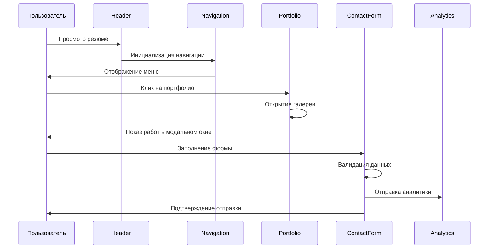

# Проектирование: Улучшение дизайна резюме

## Архитектурный обзор
Модернизация существующего React-приложения с фокусом на улучшение пользовательского интерфейса, добавление новых интерактивных компонентов и оптимизацию визуального восприятия. Решение основывается на компонентной архитектуре React с использованием современных UI-библиотек.

## Компоненты системы

### Компонент A: Новый Header
- Ответственность: Современное представление героя с улучшенной типографикой и CTA-кнопками
- Интерфейсы: Props для персонализации, событий взаимодействия
- Зависимости: Lucide icons, Tailwind CSS, анимационные хуки

### Компонент B: Навигационное меню
- Ответственность: Фиксированная навигация по разделам с индикаторами прогресса
- Интерфейсы: Scroll API, роутинг компоненты
- Зависимости: React hooks, intersection observer

### Компонент C: Интерактивная галерея портфолио
- Ответственность: Отображение работ в виде интерактивной сетки с модальными окнами
- Интерфейсы: Компоненты dialog, carousel, lazy loading
- Зависимости: Radix UI Dialog, Embla Carousel

### Компонент D: Улучшенные карточки опыта
- Ответственность: Презентация профессионального опыта в визуально привлекательном формате
- Интерфейсы: Timeline компоненты, hover эффекты
- Зависимости: CSS animations, Tailwind variants

### Компонент E: Контактная форма
- Ответственность: Интеграция формы обратной связи с валидацией
- Интерфейсы: Form API, email сервисы
- Зависимости: React Hook Form, Zod validation

### Компонент F: Цветовая система
- Ответственность: Управление пастельной цветовой палитрой
- Интерфейсы: CSS Custom Properties, Tailwind config
- Зависимости: Tailwind CSS, дизайн-токены

## Диаграмма последовательности


## Модели данных

### Модель: PortfolioItem
```json
{
  "id": "string",
  "title": "string",
  "description": "string",
  "image": "string",
  "category": "design | development | animation",
  "year": "number",
  "client": "string",
  "technologies": ["string"],
  "link": "string?"
}
```

### Модель: ContactFormData
```json
{
  "name": "string",
  "email": "string",
  "company": "string?",
  "message": "string",
  "projectType": "design | development | consultation"
}
```

### Модель: ColorTheme
```json
{
  "primary": {
    "50": "#f0f9ff",
    "100": "#e0f2fe",
    "500": "#06b6d4",
    "900": "#0c4a6e"
  },
  "secondary": {
    "50": "#fdf2f8",
    "100": "#fce7f3",
    "500": "#ec4899",
    "900": "#831843"
  }
}
```

## Обработка ошибок
| Код ошибки | Описание | Действие |
|------------|----------|----------|
| ERR-001 | Ошибка загрузки изображений портфолио | Показать placeholder, повторить загрузку |
| ERR-002 | Ошибка отправки контактной формы | Показать уведомление, сохранить данные локально |
| ERR-003 | Ошибка анимации на старых устройствах | Отключить анимации, использовать fallback |

## Соображения по безопасности
- Валидация всех пользовательских вводов в контактной форме
- CSRF защита для форм
- Санитизация данных перед отправкой
- Rate limiting для предотвращения спама

## Стратегия тестирования

### Модульные тесты
- Тестирование компонентов изоляции
- Валидация форм и пользовательского ввода
- Проверка корректности анимаций

### Интеграционные тесты
- Тестирование взаимодействия компонентов
- Проверка адаптивности на разных устройствах
- E2E тестирование пользовательских сценариев

## Дизайн-система

### Типографика
- Заголовки: Inter или системный шрифт, размеры от 14px до 48px
- Основной текст: 16px, line-height 1.6
- Акцентный текст: medium weight для выделения

### Спейсинг
- Базовая единица: 4px
- Компонентные отступы: 8px, 16px, 24px, 32px
- Секционные отступы: 48px, 64px, 96px

### Анимации
- Длительность: 200ms для hover, 300ms для переходов, 500ms для сложных анимаций
- Easing: ease-out для входящих, ease-in для исходящих
- Принцип: meaningful motion, не отвлекающий от контента

### Пастельная цветовая палитра
```scss
:root {
  --primary-50: #f0f9ff;   // Очень светлый голубой
  --primary-100: #e0f2fe;  // Светлый голубой  
  --primary-200: #bae6fd;  // Мягкий голубой
  --primary-500: #06b6d4;  // Основной голубой
  
  --secondary-50: #fdf2f8;  // Очень светлый розовый
  --secondary-100: #fce7f3; // Светлый розовый
  --secondary-200: #fbcfe8; // Мягкий розовый
  
  --accent-50: #f7fee7;     // Очень светлый зеленый
  --accent-100: #ecfccb;    // Светлый зеленый
  --accent-200: #d9f99d;    // Мягкий зеленый
  
  --neutral-50: #fafafa;    // Почти белый
  --neutral-100: #f5f5f5;   // Светло-серый
  --neutral-200: #e5e5e5;   // Мягкий серый
}
```
